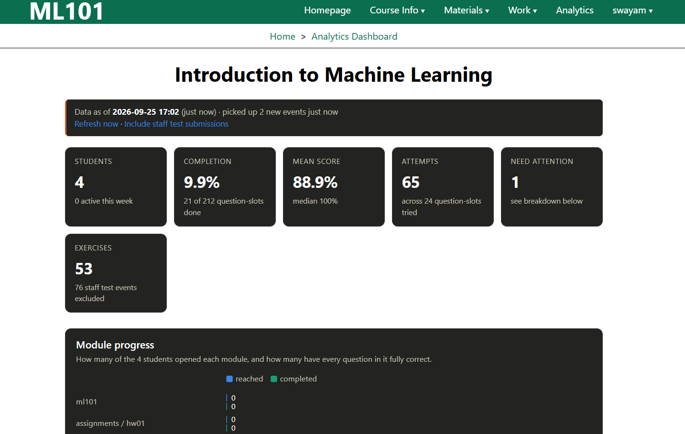
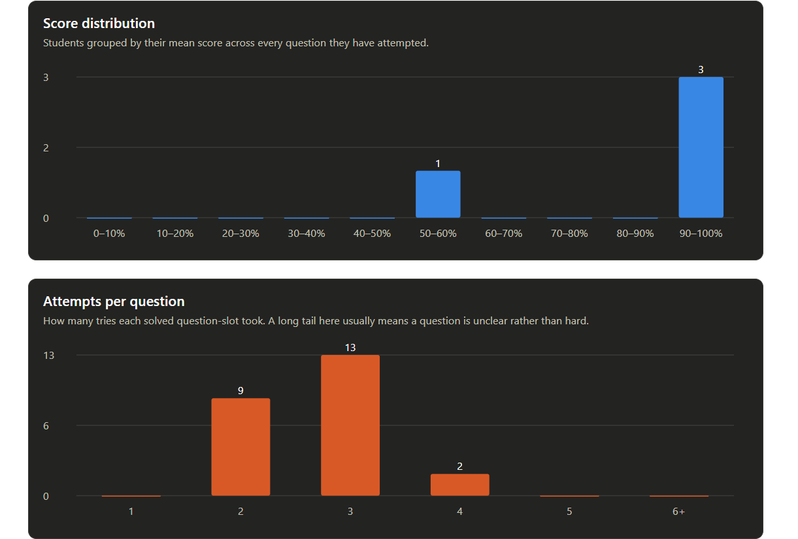
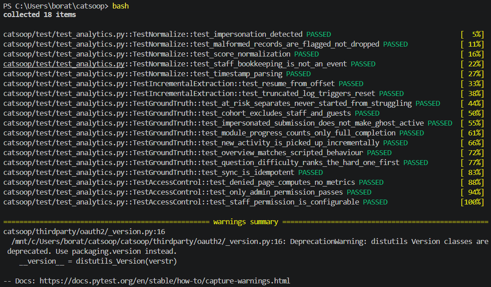
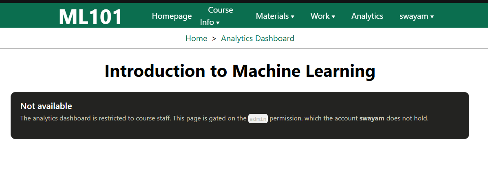
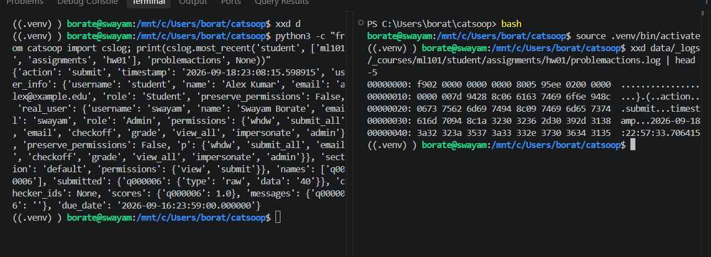
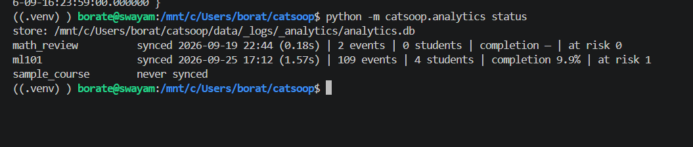
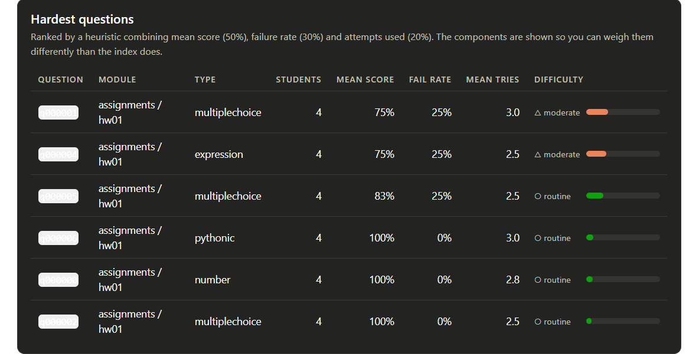
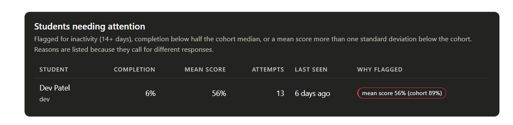

# Weekly Report 1

**Project:** Learning analytics dashboard for CAT-SOOP
**Team:** Swayam Borate, Chaitanya Sharma, Parth Dembla, Kavya Lavti, Harsh Jamgaonkar
**Instructor:** Manu Awasthi
**Week:** 18 to 25 September 2026

**What the project does.** CAT-SOOP is the system the Digital Systems course
uses to give out exercises and mark them automatically. It records what every
student does, but it keeps those records as plain files, and there is no screen
that shows a professor how the class is doing. We are building that screen. It
opens inside CAT-SOOP at `<course>/analytics` and only professors can see it.

**Why we built it this way.** Our design plan originally proposed a separate
system sitting next to CAT-SOOP, with its own web server, its own login, and its
own front end. We changed that and put everything inside CAT-SOOP instead. Three
reasons. A separate system would have needed its own way of checking who is a
professor, and writing a second login system is the kind of thing that goes wrong
quietly. It would also have been a second server to keep running. And it would
have to be kept in step with CAT-SOOP every time CAT-SOOP changed.

What we did keep from the plan is the separate database. We do not read
CAT-SOOP's files fresh every time somebody opens the page, because those files
are not organised for searching and it would get slower as the course grows. We
read them once, store the tidied version, and the page reads that. We also kept
the option of updating overnight instead of live, which matters for big classes.

We never write to CAT-SOOP's own data. We only read it. So the worst a bug in our
code can do is show a wrong number on a dashboard. It cannot damage the live
course.

---

## How it works, start to finish

```
        A student opens a page or submits an answer
                          |
                          v
        +--------------------------------------+
        |  CAT-SOOP saves a record to a plain  |   We never write here.
        |  file on disk                        |   We only read.
        +------------------+-------------------+
                           |
        ===================|====================  everything below is ours
                           v
        +--------------------------------------+
        |  1. READ                             |   Remembers how many bytes
        |     Reads only the new part of       |   it read last time, so a
        |     each file                        |   file that has not changed
        +------------------+-------------------+   is never even opened.
                           v
        +--------------------------------------+
        |  2. CLEAN AND CHECK                  |   "True" and "1.0" both
        |     Makes every record consistent    |   become "correct".
        |     Marks anything broken            |   Broken records are
        +------------------+-------------------+   counted, not thrown away.
                           |
                           |                       Professor test answers
                           |                       are spotted here and
                           v                       left out of the numbers.
        +--------------------------------------+
        |  3. STORE                            |   One database file.
        |     Saves the tidied version         |   Delete it and the next
        +------------------+-------------------+   run rebuilds it.
                           v
        +--------------------------------------+
        |  4. CALCULATE                        |   Scores, completion,
        |     Works out the numbers            |   which questions are hard,
        +------------------+-------------------+   who is falling behind.
                           v
        +--------------------------------------+
        |  5. SHOW                             |   Anyone who is not a
        |     Draws the page and the charts    |   professor is stopped
        +------------------+-------------------+   here, before step 4 runs.
                           v
              Professor sees the dashboard
```

Steps 1 to 4 run either when the professor opens the page, or overnight on a
schedule. Both work. For a class the size of Digital Systems it is fast enough to
do it when the page opens, so the numbers are always current. For a much larger
class, the overnight option is the better setting.

Steps 1 and 2 are the only parts that know what CAT-SOOP's files look like
inside. If CAT-SOOP ever changes how it stores things, only those two need
fixing, and steps 3 to 5 carry on unchanged.





*Dashboard overview
---

## 1. Tasks completed, in progress, and planned

### Completed

**Found out how CAT-SOOP stores student activity.** (Swayam)
We did not know the file format, and the documentation does not say. So we
installed CAT-SOOP, made test students, had them submit answers, then opened the
files to see what was written. We wrote down 8 things we found, each one with the
exact file and line in CAT-SOOP's code that proves it.

**Built the code that reads those files.** (Swayam)
It remembers where it stopped reading last time, so the next run only reads what
is new instead of starting over.

**Built the code that cleans and checks the data.** (Harsh)
CAT-SOOP saves a correct answer as `True` for some question types and as `1.0`
for others. This code makes them consistent. If a record is broken, it counts it
as a problem instead of throwing it away, so a bad record shows up as a number
somebody can look at.

**Built the database.** (Parth)
It is SQLite, which is a database kept in a single file, so there is no second
server to install or run. Every table is tagged with the course it belongs to, so
adding a second course later means adding rows, not redesigning.

**Built the update process and a command to run it.** (Chaitanya)
It can run overnight on a schedule or on demand. Running it twice does not
double-count anything.

**Built the tests.** (Kavya)
We invented 4 fake students and wrote their behaviour by hand, so we already know
the right answer for each. One gets everything right first try. One gets there
after several tries. One keeps failing the same question. One never starts. If
the code gives any other numbers, the code is wrong.


### Planned for next week

- Turn the data into the actual numbers shown on screen (Kavya)
- Work out how to rate a question as hard, and how to spot a student falling
  behind (Parth)
- Build the charts (Harsh)
- Make sure only professors can open the page (Swayam)
- Test it with a full class instead of a few test students (Chaitanya)

---

## 2. Problems

**We could not design the database until we knew the file format.**
Our design plan had already flagged this, so we had set time aside to check
rather than guess. Now done.

**CAT-SOOP does not record page views unless you turn a setting on.**
We did not know whether CAT-SOOP saves the fact that a student just *looked* at a
page. It does, but the setting is off by default. Without it we could not tell
apart a student who never opened a topic from one who opened it and found it too
hard to try. We turned the setting on.

**Professor test answers were being counted as student work.**
This was the worst thing we found, and our design plan did not mention it.
CAT-SOOP lets a professor view the site as a particular student to check a
question works. When they submit a test answer that way, CAT-SOOP saves it under
that student's name. So it looks exactly like the student did the work.

In our own test data, 75 out of 76 records turned out to be professor testing,
not student activity. Without catching this, the dashboard would have shown a
busy, high-scoring class that had actually done almost nothing. We now leave
these out by default, show how many were left out, and allow turning them back on.


**Our new code was invisible to the installed software.**
CAT-SOOP keeps a hand-written list of its own parts, and anything not on the list
is skipped at install time. Ours was not on it. Nothing reported an error, the
code simply was not there, which is why it took a while to find.

**The page loaded successfully but was completely blank.**
CAT-SOOP only captures printed output from code written directly in the page, not
from code in a separate file. Our output was going to the server's console log
instead of the browser.


---

## 3. Time spent by each member on each task


| Member | Task | Hours |
|---|---|---|
| Swayam | Finding out the file format | 2 |
| Swayam | Code that reads the files | 8 |
| Harsh | Code that cleans and checks data | 10 |
| Parth | Database | 9 |
| Chaitanya | Update process and command | 7 |
| Kavya | Tests | 5 |


---

## 4. Last meeting with the PoC

- **Date:** 02/09/2026
- **Who attended:** All 5
- **What was decided:** The analytics to be shown on the dashboard


---

## 5. Date of the current build


```
git log -1 --format='%h  %ad' --date=iso
```

- **Build:** 34cfedb8
- **Date:** 2026-09-18 21:19:33 +0000
- **Branch:** main


---

## 6. Results of tests on the build

 `python -m pytest catsoop/test/test_analytics.py -v`

| | |
|---|---|
| **Total tests** | **18** |
| **Unsuccessful** | **0** |

What they check:

- 5 tests: the different ways CAT-SOOP saves a score all come out the same, and
  broken records get counted instead of dropped
- 2 tests: the reader really does carry on from where it stopped, and copes if a
  file is rebuilt
- 8 tests: the 4 fake students give exactly the numbers they should
- 3 tests: a non-professor cannot open the page, and when access is refused no
  student data is worked out at all



*Automated QA: the named tests cover normalization, incremental extraction,
ground-truth personas, impersonation, and access control.*

---

## 7. Defects found in QA

5 found, 5 fixed, 0 still open.

| # | What went wrong | How bad | Status |
|---|---|---|---|
| 1 | Page loaded fine but showed nothing. Output was going to the server log instead of the browser. | Blocked the whole feature | Fixed |
| 2 | New code not visible to the installed software, because it was missing from CAT-SOOP's list of parts. | Blocked the whole feature | Fixed |
| 3 | The permission check looked like it was rejecting a valid professor account. It was not. This was defect 1 in disguise, because the "access denied" message was also going to the server log. After fixing defect 1 we re-tested every role and the check was correct. | Not a real bug | Closed |
| 4 | A function was called with its arguments in the wrong order. Made during an edit, caught straight away. | Would have crashed | Fixed |
| 5 | The update process took 1.45 seconds even with nothing to do, because it re-read the whole course structure every time. Now it only re-reads what changed. | Slow, not wrong | Fixed (0.46s) |



*Server-side access control refuses the TA request before any dashboard data is
rendered.*

---

## Interesting things we found along the way

These are not problems, just things worth knowing about how CAT-SOOP works.

**CAT-SOOP has no database at all.** We expected to find one. Everything, every
submission by every student, is stored as plain files in folders. For the whole
system there are only four kinds of record file: one for what a student did, one
for where they currently stand, one listing the questions on a page, and one for
randomised question values.

**Every record has its length written twice, before it and after it.** The copy
at the end looks redundant, but it is how CAT-SOOP jumps to the newest record
without reading the whole file: it reads the last few bytes and works backwards.
We used the same idea in the opposite direction. We save how many bytes we have
already read, so next time we skip straight to the new part. That one detail is
the reason the dashboard can refresh when you open it instead of only once a
night, and it is why our update takes the same time for a class of 250 as for a
class of 2,000.

```bash
xxd data/_logs/_courses/ml101/student/assignments/hw01/problemactions.log | head -5
python -c "from catsoop import cslog; print(cslog.most_recent('student', ['ml101','assignments','hw01'], 'problemactions', None))"
```




*On-disk evidence: the raw record shows the repeated length framing, and the
decoded dictionary is the same record read by CAT-SOOP's log reader.*




*Operational status: the CLI reports sync time, event count, cohort size,
completion, and at-risk count for each course.*

**We got the list of questions for free.** We assumed we would have to read the
course material to find out what questions exist and what type each one is. It
turns out CAT-SOOP already writes that down by itself whenever a page is
displayed. So we read its file instead and never touch the course content.

**CAT-SOOP already counts attempts, so we do not.** It keeps its own count for
its "you have 2 tries left" logic. We read that number rather than counting
submissions ourselves. This means our attempt count can never disagree with what
the student was actually shown, which it could easily have done if we had
recalculated it.

**The dashboard found a real broken question before it was even finished.** While
testing, one question showed 0% for every single student. We assumed our own code
was wrong. It was not. The question itself was broken, and it was quietly marking
every correct answer as wrong. We would not have noticed by clicking through the
course by hand, because each answer looks fine on its own. It only stood out once
all four students were shown side by side. That is exactly what the dashboard is
for, and it did it by accident while we were still building it.

### What the dashboard shows



*Difficulty components: mean score, fail rate, mean tries, and the resulting
difficulty rating are shown together.*



*At-risk reasoning: the reason chips show whether a student is inactive or
substantially below the cohort's completion level.*


### The code behind the four findings above

**Record framing** (`catsoop/analytics/extract.py`):

```python
_HEADER = struct.Struct("<Q")
head = f.read(8)
(length,) = _HEADER.unpack(head)
payload = f.read(length)
f.read(8)  # trailing copy of the length
```

**Impersonation filtering** (`catsoop/analytics/normalize.py`):

```python
real = real_submitter(rec.get("user_info"))
impersonated = bool(real) and real != username
```

**Permission gate before metrics** (`catsoop/analytics/page.py`):

```python
if not is_staff(ctx):
    return _denied(ctx)
```

**Idempotent course sync** (`catsoop/analytics/__main__.py`):

```python
report = sync.sync_course(course)
print(report)
```


---
